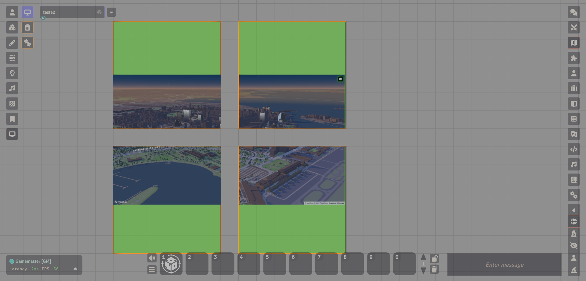
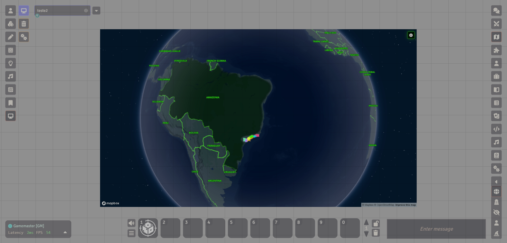
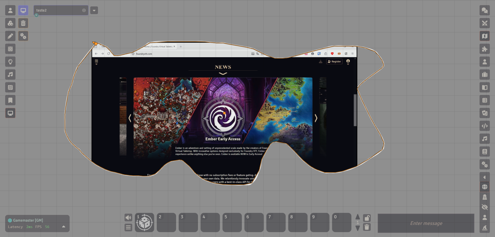
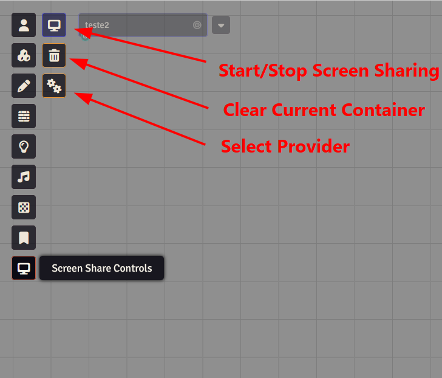
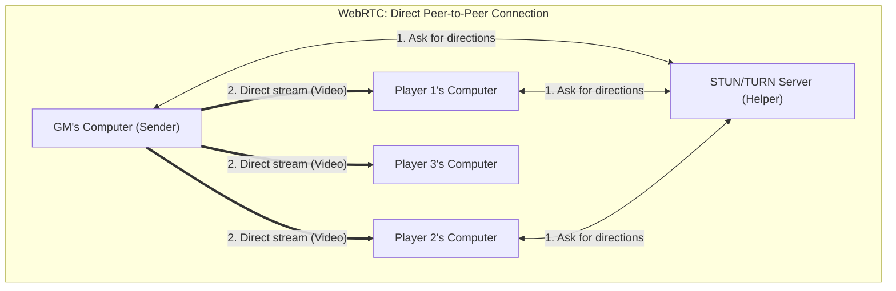
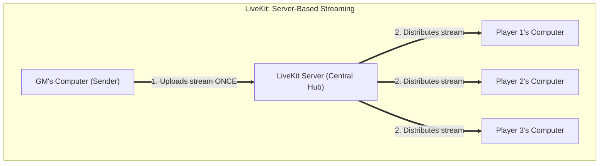

# Screen Share VTT Module

**Screen Share** is a Foundry VTT module designed to let Gamemasters (GMs) broadcast their screen or specific windows directly onto the game canvas. Using Foundry's native elements, you can stream maps, videos, document references, or slides directly into the game scene itself, creating an immersive, real-time shared visual experience.

---

## 📖 Table of Contents
1. [Core Features](#-core-features)
2. [Installation](#-installation)
3. [Containers (Where to show the screen)](#-containers-where-to-show-the-screen)
4. [Providers (How the video is sent)](#-providers-how-the-video-is-sent)
5. [Usage](#-usage)
6. [Configuration](#-settings-configuration)
7. [How it Works (Simple Architecture)](#-how-it-works-simple-architecture)

---

## ✨ Core Features
- **GM Screen Broadcasting**: GM can choose to capture their entire screen, a browser tab, or a single application window.
- **Decoupled Backends**: Support for direct Peer-to-Peer streaming (WebRTC) or Server-assisted streaming (LiveKit).
- **Flexible Fit Modes**: Scale the video to fit within containers using **Contain**, **Cover** (stretching with crop), or **Fill**.
- **Per-Container Overrides**: Set custom resolutions, frame rates, and fit modes on individual containers.

---

## ⚙️ Installation

1. Open the Foundry VTT Setup screen.
2. Go to the **Add-on Modules** tab.
3. Click **Install Module**.
4. In the **Manifest URL** field, paste the following link:
   ```
   https://raw.githubusercontent.com/OverNinja/FoundryScreenShare/main/module.json
   ```
5. Click **Install**.
6. Activate the module inside your World settings.


---

## 📺 Containers

A **Container** is any object on the scene canvas that you designate to show the screen share. 
Open the configuration sheet of any of the following types, navigate to the **Screen Share** tab, and toggle **Screen Share Container** on.

1. **Scene Regions (v14 only)**:
   - Best for custom or irregular shapes.
   - The video stream will automatically clip to match the exact boundaries of the drawn region polygon.
   
   

2. **Tiles**:
   - Best for rectangles, TV screens, mirrors, or portal tokens.
   - **About Empty Tiles**: If a tile is empty (has no image configured), it does not trully "exists" in the canvas, and the transmission will show notting. The module automatically applies a invisible 1x1 transparent image under the hood to such tiles, so they can exist on the canvas. If you configure a custom image path, that image is shown when you are *not* sharing your screen, and gets covered by the video when you *are* sharing.
   
   

3. **Drawings**:
   - For any drawing shape, the video is clipped to the boundaries of the shape, like with regions, but only one shape is possible.
   
   


---

## 🔌 Providers

You can configure which streaming technology is active via the module settings or container overrides:

- **Local Screen Share (Testing)**: A local loopback test. Captures your screen but does not transmit it over the network. Perfect for testing layout sizing and fit modes.
- **WebRTC Screen Share**: Direct peer-to-peer transmission using native browser connections.
- **LiveKit Stream Share**: Heavy-duty server-assisted streaming.

---

## 🚀 Usage

Here is how to set up, configure, and use the Screen Share module in your games.

### 1. Placing Objects and Setting Containers

To display a screen share, you must first place a compatible object on the canvas and designate it as the active screen share container.

1. **Place a container**: Draw a **Scene Region** (v14+), place a **Tile**, or create a **Drawing** on the scene canvas.
2. **Open Configuration**: Double-click the object to open its configuration sheet.
3. **Enable Screen Share**: Navigate to the **Screen Share** tab and toggle the **Screen Share Container** checkbox on.
4. **Save Config**: Click **Update** to save the sheet.

*Note: Only one container can be marked as the active screen share target per scene. If another object is already set as the container, the checkbox on other objects will be disabled.*

<!-- PLACEHOLDER: Print of Container Configuration Screen showing the Screen Share tab and toggle -->


---

### 2. Container Configurations

Inside the **Screen Share** tab of any container configuration sheet, you can customize how the video stream behaves when rendered inside that specific container:

* **Video Fit Mode**: Determines how the video scales inside the container:
  - `Default`: Inherits the global fit mode setting.
  - `Contain`: Scales the video to fit within the container boundaries while preserving aspect ratio (adds letterboxing/pillarboxing).
  - `Cover`: Scales the video to completely cover the container boundaries, preserving aspect ratio (crops overflowing video).
  - `Fill`: Stretches the video to match the container shape exactly, ignoring the aspect ratio.
* **Maximum Frame Rate**: Overrides the maximum capture framerate for this container (Default, Auto, 15 FPS, 30 FPS, 60 FPS).
* **Maximum Resolution**: Overrides the maximum capture height for this container (Default, Auto, 720p, 1080p).


---

### 3. How to Start the Stream

Once a container is designated, the GM can start broadcasting:

1. Locate the **Screen Share Controls** tool group on the left Scene Controls toolbar.
2. Click the **Start/Stop Screen Share** toggle button.
3. Your browser will prompt you to select the screen, application window, or browser tab you wish to share.
4. Confirm your selection. The stream will begin and render directly onto the designated container on the canvas for you and all connected players.
5. Click the toggle button again to stop the stream.

---

### 4. Dedicated Controls Tool Group
<!-- PLACEHOLDER: Print of Browser Screen Selection Dialog / Active stream rendering on Canvas -->



The dedicated **Screen Share Controls** tool group (visible only to Gamemasters) includes the following tools for managing your broadcast:

* **Start/Stop Screen Share**: Launches the screen capture process and begins the stream, or terminates the current broadcast session.
* **Remove Screen Container Mark**: Clears the container flag from whichever object in the active scene is currently marked as the screen container, without needing to open its sheet.
* **Select Streaming Backend**: Opens a dialog where GMs can select the active streaming provider (e.g., Local Screen Share, WebRTC Screen Share, or LiveKit Stream Share).

<!-- PLACEHOLDER: Print of the left Scene Controls bar showing the Screen Share Controls tool group and buttons -->


---

## 🛠️ Configuration

Configure settings by going to **Game Settings** -> **Configure Settings** -> **Module Settings** -> **Screen Share**:

### Global Settings
* **Active Backend**: Select which provider to use (`Local`, `WebRTC`, or `LiveKit`).
- **WebRTC ICE Server URL**: The address of the STUN/TURN server used for WebRTC discovery (Defaults to Google's public STUN server: `stun:stun.l.google.com:19302`).
- **WebRTC TURN Username / Credential**: Auth credentials if you are using a secure, private TURN server.
- **Maximum Capture Framerate**: Limit stream framerate (Auto, 15 FPS, 30 FPS, or 60 FPS) to conserve bandwidth.
- **Maximum Capture Resolution**: Limit maximum stream height (Auto, 720p, or 1080p).
- **Default Video Fit Mode**: 
  - `Contain`: Scales the video to fit entirely inside the container (leaves blank borders if aspect ratios differ).
  - `Cover`: Fills the container completely, cropping the edges of the video if necessary.
  - `Fill`: Stretches the video to match the container's exact shape, ignoring the video's original aspect ratio.

### LiveKit Specific Settings
- **LiveKit Server URL**: The WebSocket URL of your LiveKit server (e.g. `wss://project.livekit.cloud`).
- **LiveKit API Key**: The access key for your LiveKit project.
- **LiveKit API Secret**: The security secret key (strictly hidden from players, only seen by GMs).
- **LiveKit Room Name**: The room name where the stream is broadcasted (Defaults to `foundry-screen-share`).

---

## 🗺️ How it Works (Simple Architecture)

To stream your screen to your players, the module utilizes one of two methods. Here is a simple explanation of how they differ under the hood.

### Option A: WebRTC (Peer-to-Peer)
In a Peer-to-Peer setup, your computer connects directly to each of your players' computers. 



* **How it works**: The GM and players use a public helper server (called a STUN/TURN server) for a split second just to swap "directions" on how to find each other. Once they do, the GM's computer streams the video directly to each player.
* **👍 Pros**: Completely free and works right out of the box with public servers.
* **👎 Cons**: High bandwidth usage for the GM. If you have 5 players, your home internet must upload the video stream 5 times simultaneously. Some strict routers or school/workplace firewalls may also block direct connections.

---

### Option B: LiveKit (Server-Based)
In a server-based setup, the GM uploads the video once to a central server, which then takes care of distributing it to the players.



* **How it works**: Instead of connecting to every player, the GM connects to a central LiveKit Server. The GM uploads the screen share stream exactly **once**. The server duplicates it and forwards it to each player's computer.
* **👍 Pros**: Extremely light on the GM's internet upload speed. Connections are highly stable, fast, and bypass almost all firewall blocks.
* **👎 Cons**: Requires hosting or renting a LiveKit server (though free-tier cloud accounts are often sufficient).
