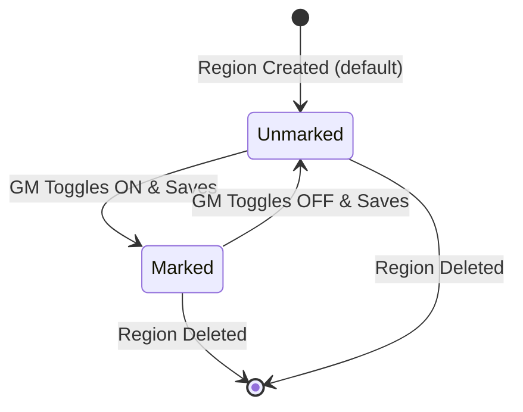

# Data Model: Region Screen Container

This document defines the data model changes, validation rules, and state transitions for marking a Region as the screen share container.

## Entity Extensions

### RegionDocument (Foundry Core Document)
The region configuration relies on storing a custom namespaced flag on the standard `RegionDocument` entity.

| Field / Flag Path | Type | Default | Description |
|:---|:---|:---|:---|
| `flags.screen-share.isScreenContainer` | `boolean` | `false` | If `true`, indicates this region is the designated recipient/container for the shared screen. |

## Schema & Validation Rules

1. **Namespace isolation**:
   - All flags related to this feature MUST be nested under the `screen-share` namespace key to prevent collisions with other VTT modules or system-defined flags.

2. **Single Container Constraint (per Scene)**:
   - At most one region in any given scene may have `flags.screen-share.isScreenContainer` set to `true`.
   - **Conflict Resolution (Fallback)**: If multiple regions on a scene have the flag set to `true` (e.g. via direct script manipulation or database import):
     - The active container will be resolved as the first region document matching the flag when sorted alphabetically by Document ID (`_id`).
     - GMs configuring any other region with the flag set to `true` will see the conflict warning, but are allowed to uncheck it to resolve the conflict.

3. **Role Restrictions**:
   - Only Gamemasters (GMs) are authorized to modify document flags. Attempting to update `flags.screen-share.isScreenContainer` from a non-GM client must be blocked by standard Foundry server-side document permission checks.

## State Transitions

### Transition Lifecycle:
* **Transition to Marked**:
  - Triggered by user save in `RegionConfig` sheet or programmatic API update.
  - Adds/updates `flags.screen-share.isScreenContainer` to `true`.
  - Fires core Foundry document update hook `updateRegion`.
  - All clients receive the updated region document.
* **Transition to Unmarked**:
  - Triggered by user untoggle in `RegionConfig` sheet, conflict resolution, or programmatic API update.
  - Sets `flags.screen-share.isScreenContainer` to `false` or removes/unsets the flag.
  - Fires core Foundry document update hook `updateRegion`.
  - All clients receive the updated region document.
* **Region Deletion**:
  - Triggered by region deletion.
  - Fires core Foundry document delete hook `deleteRegion`.
  - If the deleted region was the marked screen container, the scene effectively has no screen container. No additional cleanup is required since the document (and its flags) are fully removed.
