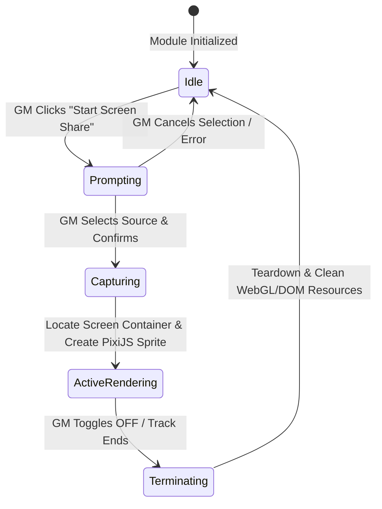

# Data Model & State Management: Local Screen Share

This document defines the runtime entities and state management lifecycle for local screen share capture and rendering on the GM client.

## Runtime Entities

### 1. globalThis.ScreenShare (Global Module API)
Exposes the core module APIs and manages the active stream provider.

| Field / Property | Type | Access | Description |
|:---|:---|:---|:---|
| `streamProvider` | `StreamProvider \| null` | Read-only | The active stream provider instance. |
| `isSharing` | `boolean` | Read-only | Helper getter indicating if screen share is currently active. |
| `startShare()` | `Function` | Public | Asynchronous function to begin screen sharing. |
| `stopShare()` | `Function` | Public | Asynchronous function to stop screen sharing. |

### 2. StreamProvider (Abstract Base Class)
Defines the interface for all streaming technologies.

| Property / Method | Type | Description |
|:---|:---|:---|
| `startStream()` | `Promise<MediaStream>` | Starts the screen share and resolves to the captured stream. |
| `stopStream()` | `Promise<void>` | Stops the screen share and terminates tracks. |
| `isActive` | `boolean` | Returns `true` if a stream is active and capturing. |

### 3. LocalStreamProvider (Concrete Class)
Implements local capture using browser APIs.

| Field / Property | Type | Description |
|:---|:---|:---|
| `#stream` | `MediaStream \| null` | The captured browser MediaStream object. |
| `#onEndedCallback` | `Function` | Callback fired when the video track ends externally (e.g. browser bar). |

---

## State Transitions & Stream Lifecycle

The local screen sharing state is managed dynamically in memory on the GM client.

### Transition Descriptions:

1. **Idle to Prompting**:
   - **Trigger**: GM clicks the toggle button or calls `ScreenShare.startShare()`.
   - **Actions**: Verify GM role, retrieve the active screen container region. If not found, abort and warn. Otherwise, instantiate `LocalStreamProvider` and call `startStream()`.

2. **Prompting to Capturing**:
   - **Trigger**: Browser displays screen selection dialog and GM selects a source.
   - **Actions**: Obtain the MediaStream object and assign track listeners.

3. **Capturing to ActiveRendering**:
   - **Trigger**: MediaStream successfully resolved.
   - **Actions**:
     - Create hidden `<video>` element.
     - Generate `PIXI.Texture` from the video.
     - Create `PIXI.Sprite` and place it in a masked container.
     - Add the container to the target `RegionObject` on the canvas.

4. **ActiveRendering to Terminating**:
   - **Trigger**: GM clicks the toggle button again or clicks the browser's "Stop sharing" overlay bar.
   - **Actions**: Initiate teardown workflow.

5. **Terminating to Idle**:
   - **Trigger**: Teardown complete.
   - **Actions**: Stop stream tracks, destroy PixiJS texture and sprite, remove video from DOM, repaint region, and reset toggle button visual state.
