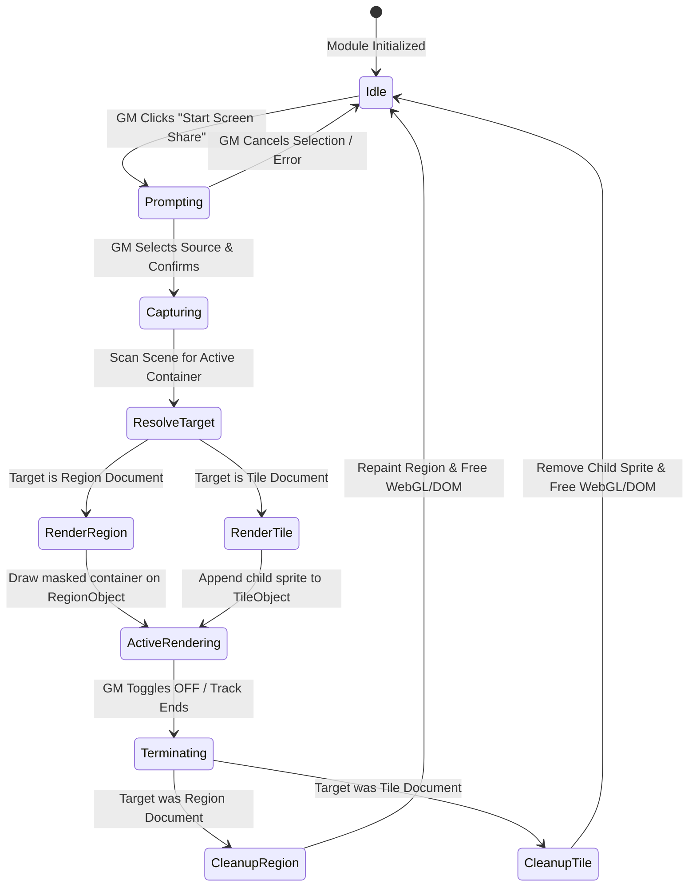

# Data Model & State Management: Tile and Region Screen Share Container

This document defines the runtime entities, persistence flags, and state management lifecycle for the Tile and Region Screen Share Container feature.

## Runtime Entities

### 1. globalThis.ScreenShare (Global Module API Updates)
No structural interface changes are introduced, maintaining strict compatibility, but the internals of helper methods are updated.

| Field / Property | Type | Access | Description |
|:---|:---|:---|:---|
| `getScreenContainer(scene)` | `Function` | Public | Scans both Regions and Tiles in the active scene. Returns the active `RegionDocument` or `TileDocument`, or null. |
| `isRegionActiveContainer(region)` | `Function` | Deprecated/Legacy | Retained for backward compatibility. |

### 2. Document Flags (Persistence)
Both Region and Tile documents store the container designation flag.

* **Namespace**: `screen-share`
* **Key**: `isScreenContainer`
* **Type**: `boolean`

---

## State Transitions & Stream Lifecycle

The screen sharing state transition lifecycle is enhanced to support polymorphic container targets.

### Transition Descriptions:

1. **Capturing to ResolveTarget**:
   - **Trigger**: MediaStream successfully captured.
   - **Actions**: Call `ScreenShare.getScreenContainer(activeScene)`. If no container (Region or Tile) is returned, trigger abort and clean up.

2. **ResolveTarget to RenderRegion / RenderTile**:
   - **Trigger**: Determine the document type of the resolved container.
   - **Actions**:
     - If it is a `RegionDocument`, execute region-specific PixiJS polygon masking and container injection.
     - If it is a `TileDocument`, instantiate a video-backed sprite with dimensions equal to the tile's width/height, and add it as a child of the `Tile` placeable object.

3. **ActiveRendering to Terminating**:
   - **Trigger**: GM triggers Stop Share, switches scene, or the browser track is stopped.
   - **Actions**: Enter teardown phase.

4. **Terminating to Idle**:
   - **Actions**:
     - Remove rendering container from the parent placeable object (`RegionObject` or `TileObject`).
     - Destroy the `PIXI.Sprite` and `PIXI.Texture` explicitly.
     - Detach the hidden HTML video element from the DOM and pause it.
