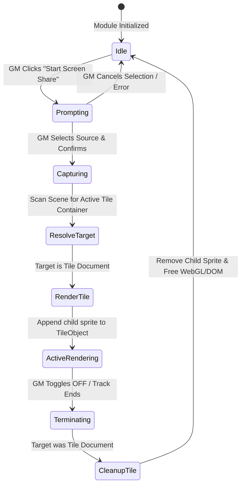

# Data Model & State Management: Foundry v13 Tile Compatibility

This document defines the runtime version state, persistence layer, and lifecycle transitions adapted for Foundry VTT v13 compatibility.

## Runtime Entities & Constants

### 1. Version Context

The module dynamically detects and stores the Foundry VTT version at initialization.

| Field / Property | Type | Default | Description |
|:---|:---|:---|:---|
| `game.release.generation` | `number` | `undefined` on older versions | Used to determine the exact generation. |
| `game.version` | `string` | `undefined` on newer versions | Fallback version string (e.g., `"11.315"`). |
| `ScreenShare.isV14OrLater` | `boolean` | Computed | True if detected generation is 14 or higher. |
| `ScreenShare.controlsLayer` | `null` | `null` | Omitted/null for both versions to keep the currently active canvas layer selected. |

### 2. Document Flags (Persistence)

Tile document flags persist identically on both v13 and v14. Since Region documents do not exist on v13, only Tiles can store this flag.

* **Namespace**: `screen-share`
* **Key**: `isScreenContainer`
* **Type**: `boolean`

---

## State Transitions & Stream Lifecycle (Foundry v13 Context)

When running on Foundry v13, the stream lifecycle bypasses all region-specific resolving and rendering steps.

### Transition Descriptions:

1. **Capturing to ResolveTarget**:
   - **Trigger**: MediaStream successfully captured.
   - **Actions**: Call `ScreenShare.getScreenContainer(activeScene)`. On v13, this will only return Tile documents since `scene.regions` is undefined.

2. **ResolveTarget to RenderTile**:
   - **Trigger**: The resolved container is a `TileDocument`.
   - **Actions**:
     - Instantiate a video-backed sprite with dimensions equal to the tile's width/height.
     - Add the sprite as a child of the `Tile` placeable object (using `mesh` or `primary` if available, otherwise overlaying on `canvas.primary`).

3. **ActiveRendering to Terminating**:
   - **Trigger**: GM triggers Stop Share, switches scene, or the browser track is stopped.
   - **Actions**: Enter teardown phase.

4. **Terminating to Idle**:
   - **Actions**:
     - Remove rendering container from the `TileObject` or `canvas.primary`.
     - Destroy the `PIXI.Sprite` and `PIXI.Texture` explicitly.
     - Detach the hidden HTML video element from the DOM and pause it.
