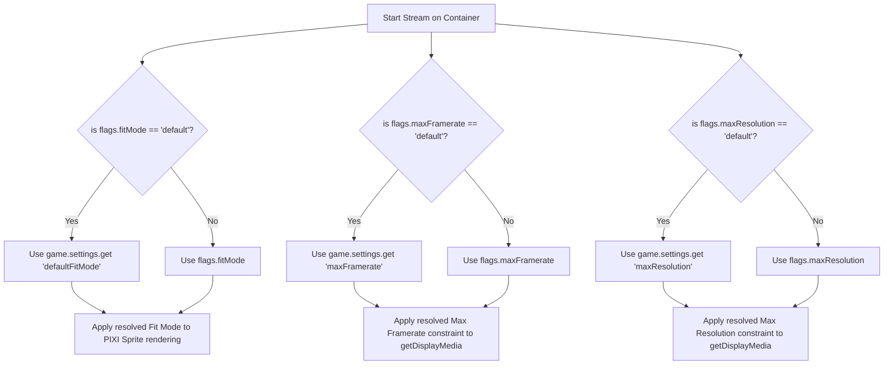

# Data Model: Container Configuration Tab

This document describes the settings and document flag structures used to store and resolve container-specific configurations.

## 1. Global Settings Data Schema

We register a new module setting to represent the global default fit mode.

### Setting: `defaultFitMode`
- **Scope**: `client` (each player/GM can choose how they fit streams by default, or `world` to enforce consistency. Let's scope it as `client` or `world`? The existing settings: `maxFramerate` and `maxResolution` are `client` settings. So let's make `defaultFitMode` a `client` setting to match `maxFramerate` and `maxResolution` consistency!).
- **Type**: `String`
- **Default**: `"contain"`
- **Choices**:
  - `"contain"`: Contain video inside container (aspect ratio preserved, letterboxing/pillarboxing).
  - `"cover"`: Cover container with video (aspect ratio preserved, cropped).
  - `"fill"`: Stretch video to fill container.

---

## 2. Document Flags Schema

Every container (Region, Tile, and Drawing) stores its configuration using namespaces flags under the `"screen-share"` module scope.

### Flags on Region, Tile, or Drawing:
- **`isScreenContainer`**: `Boolean` (true if the document is designated as the active screen share container).
- **`fitMode`**: `String` (custom fit mode override).
  - Choices: `"default"`, `"contain"`, `"cover"`, `"fill"`
  - Default: `"default"`
- **`maxFramerate`**: `String|Number` (custom maximum capture frame rate override).
  - Choices: `"default"`, `0` (Auto), `15`, `30`, `60`
  - Default: `"default"`
- **`maxResolution`**: `String` (custom maximum capture resolution override).
  - Choices: `"default"`, `"auto"`, `"720p"`, `"1080p"`
  - Default: `"default"`

---

## 3. Configuration Resolution Lifecycle

When starting a screen share session, settings are resolved dynamically:

